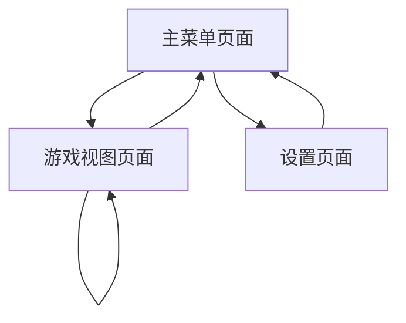

## 1. Product Overview

《乌合之众》是一款基于 Electron 的桌面视觉小说游戏，采用 Vite + React 技术栈构建。游戏提供沉浸式的对话体验、角色立绘展示和自动存档功能，让玩家通过点击推进剧情发展。

该产品旨在为视觉小说爱好者提供一个现代化的桌面游戏体验，支持跨平台运行（Windows、macOS、Linux），可完全离线使用。

## 2. Core Features

### 2.1 User Roles

本产品采用单用户模式，无需用户注册或登录系统。所有玩家都具有完整的游戏访问权限。

### 2.2 Feature Module

我们的《乌合之众》需求包含以下主要页面：

1. **主菜单页面**：游戏启动界面，包含开始游戏、继续游戏、设置选项。
2. **游戏视图页面**：核心游戏界面，包含对话框、角色立绘舞台、背景显示。
3. **设置页面**：游戏配置界面，包含音量调节、显示设置、存档管理。

### 2.3 Page Details

| Page Name | Module Name | Feature description            |
| --------- | ----------- | ------------------------------ |
| 主菜单页面     | 游戏启动模块      | 显示游戏标题、提供开始新游戏和继续游戏选项、访问设置菜单   |
| 主菜单页面     | 存档检测模块      | 自动检测是否存在存档文件，动态显示"继续游戏"按钮可用状态  |
| 游戏视图页面    | 对话系统        | 显示角色对话文本、支持点击推进对话、实现打字机动画效果    |
| 游戏视图页面    | 角色立绘舞台      | 渲染角色立绘图像、处理角色出现/消失动画、支持多角色同时显示 |
| 游戏视图页面    | 背景显示系统      | 加载和切换场景背景图片、支持背景过渡动画效果         |
| 游戏视图页面    | 游戏引擎核心      | 解析游戏脚本、管理游戏状态、控制剧情推进逻辑         |
| 游戏视图页面    | 自动存档系统      | 在关键剧情点自动保存游戏进度、支持快速存档和读档       |
| 设置页面      | 音频控制模块      | 调节背景音乐和音效音量、支持静音切换功能           |
| 设置页面      | 显示设置模块      | 调整窗口大小、切换全屏模式、设置文本显示速度         |
| 设置页面      | 存档管理模块      | 查看存档列表、删除存档文件、导入导出存档数据         |

## 3. Core Process

玩家启动游戏后进入主菜单，可以选择开始新游戏或继续之前的进度。进入游戏后，通过点击屏幕推进对话，游戏引擎会自动解析脚本内容，更新角色立绘和背景，并在关键节点自动保存进度。玩家可以随时通过ESC键返回主菜单或访问设置页面。

## 4. User Interface Design

### 4.1 Design Style

* **主色调**：深蓝色 (#1a1a2e) 和金色 (#ffd700) 搭配，营造神秘优雅的氛围

* **次要颜色**：白色 (#ffffff) 用于文本，灰色 (#666666) 用于次要信息

* **按钮样式**：圆角矩形按钮，支持悬停和点击动画效果

* **字体**：中文使用思源黑体，英文使用 Roboto，主要字号 16px-24px

* **布局风格**：卡片式布局，顶部导航，响应式设计

* **图标风格**：简约线性图标，支持主题色彩适配

### 4.2 Page Design Overview

| Page Name | Module Name | UI Elements                                 |
| --------- | ----------- | ------------------------------------------- |
| 主菜单页面     | 游戏启动模块      | 居中垂直布局，大标题使用金色渐变效果，按钮采用深蓝色背景配白色文字，悬停时显示金色边框 |
| 游戏视图页面    | 对话系统        | 底部固定对话框，半透明黑色背景，白色文字，左侧显示角色头像，支持打字机动画       |
| 游戏视图页面    | 角色立绘舞台      | 全屏背景图片，角色立绘居中或偏左/右显示，支持淡入淡出过渡动画             |
| 设置页面      | 音频控制模块      | 滑块控件使用金色主题，数值显示在右侧，静音按钮采用切换图标设计             |

### 4.3 Responsiveness

本产品为桌面优先设计，支持窗口大小调整和全屏模式。界面元素采用相对布局，确保在不同分辨率下的良好显示效果。不考虑触摸交互优化，专注于鼠标和键盘操作体验。
